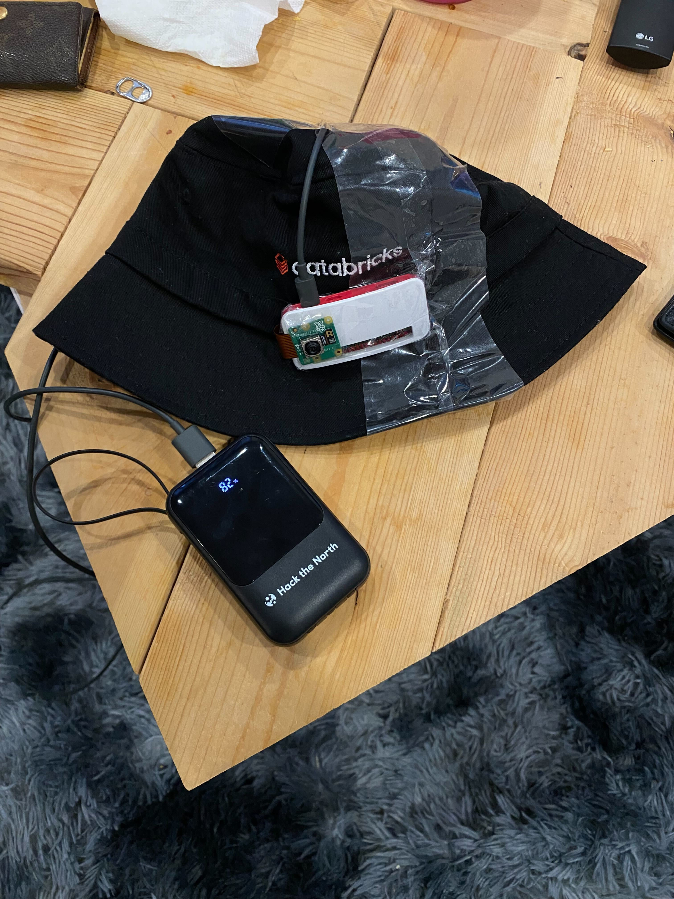

## Meet Mookie, your personal music pookie
> *By: Annie Yu, Pranav Varma, Anthony Ung, and Joshua Shiman*

**Mookie** transforms your daily routine into a cinematic experience. Mookie is an integrated wearable experience focused on making each day special, powered by a small Raspberry Pi Zero and powerful vision capable AI-models. Mookie creates and plays bespoke playlists throughout the day by continuously taking snapshots of your experiences at regular intervals throughout the day. Mookie analyze attributes, feelings and the mood of your current environment using a locally-hosted, open source, multi-modal GenAI model. Mookie takes the sentiments and and key factors as input for a semantic search of publicly sourced music datasets and maps the vibes of your scene to songs that Mookie procures and compiles into a playlist in real-time as you listen in. At the end of your day, Mookie provides a fun and convinient daily wrapped to digest and make every day special.

## Why build Mookie?
In 2024, 48.6% of Canadians aged 15 and older were highly satisfied with their lives, down from 54.0% three years earlier. (Government of Canada 2024) Canadians are looking for solutions that can help them be more satisfied with their daily lives. That's where Mookie comes in! We feel that music can play a huge role in how we feel, and Mookie creates playlists in real-time to make every moment just a little bit more special.

## How to Run - Backend

1. Clone repository

`git clone https://github.com/annooee/mookie`

2. Active virtual environment

`python3 -m venv .venv`

`source .venv/bin/activate`

3. Install requirements

`pip3 install -r requirements.txt` 

4. Run flask server

`python3 app.py`

5. Send image from client to flask server

`python3 send_image.py <your file path here>`

`ex. python3 send_image.py /Users/jshiman/Desktop/annie.png`

## How to Run - Frontend

1. Navigate to Frontend

`cd frontend/mookie`

2. Build Node server

`npm build`

3. Start Node server

`npm start`

## How to Run - Raspberry Pi
Images are taken and named image.png

1. SSH into raspberry pi

`ssh root@dietpi` or `ssh root@<RASPBERRY PI IP ADDRESS>`

2. Update Raspberry Pi 

`sudo apt update`

3. Install picamera2

`sudo apt install -y python3-picamera2`

4. Install requirements

`pip3 install -r requirements.txt`

5. Edit send_image.py and modify `url` to point to your Flask server IP Address

`url = 'http://<YOUR FLASK SERVER ADDRESS>:5000/upload'` 

6. Navigate to directory and start server

`cd mookie/raspberry-pi/`

`python3 server.py`

6. From langchain/any client device, send a request to raspberry pi to trigger image capture and upload

`curl http://dietpi:8080/capture_and_send`
